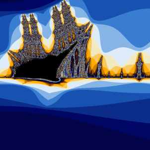
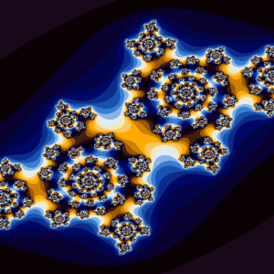
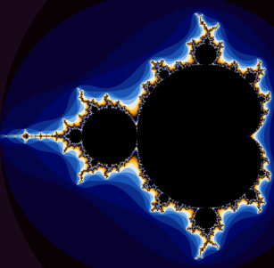

# Fractol_42
Fractol is a project aimed at exploring fractals, mathematical sets that exhibit a repeating pattern displayed at every scale.

## Pictures
### Mandelbrot

### Julia

### BurningShip

